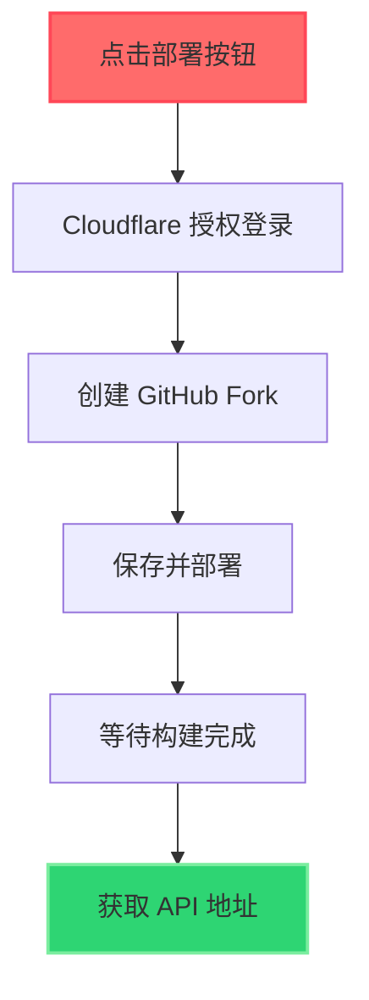
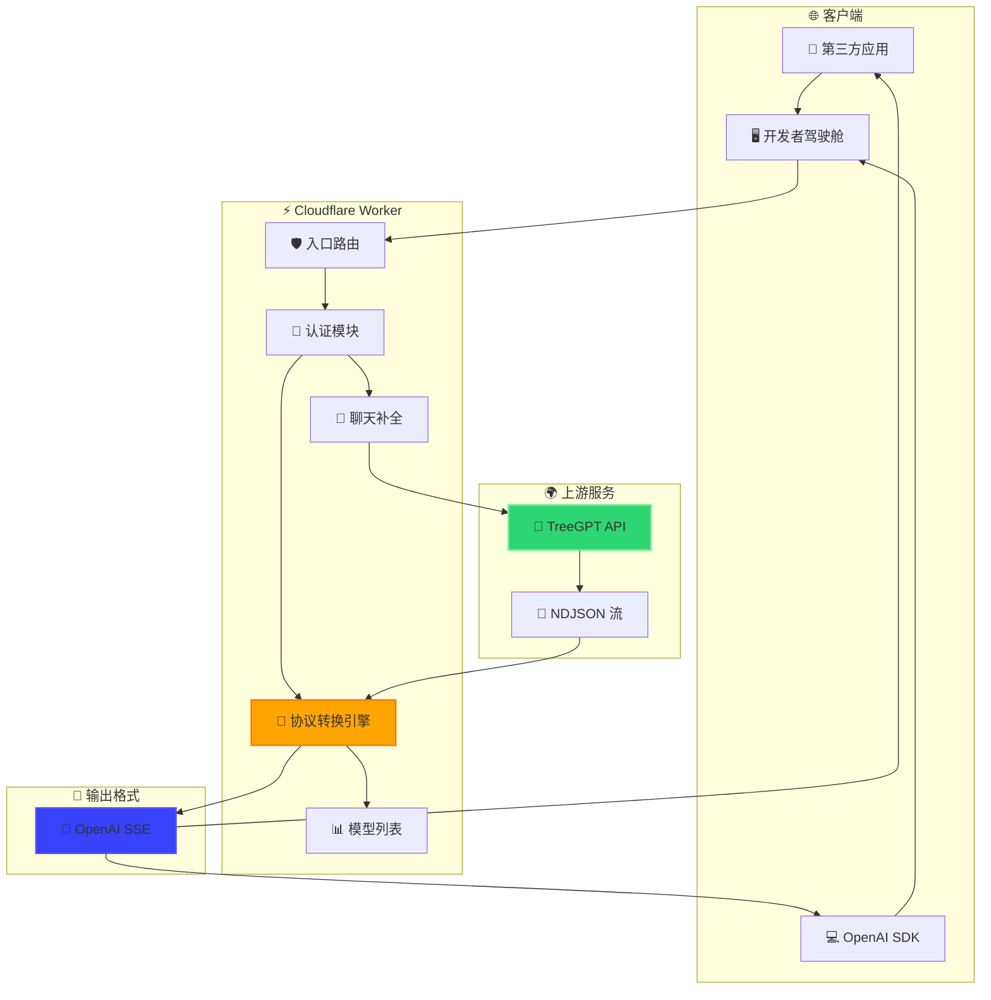
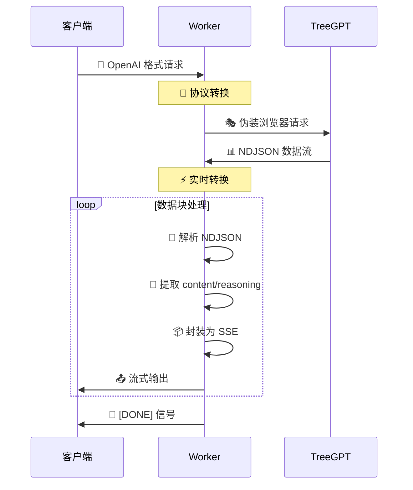

# 🌲 treegpt-2api (Cloudflare Worker 单文件版)

[](https://github.com/lza6/treegpt-2api-cfwork)
[](https://github.com/lza6/treegpt-2api-cfwork/blob/main/LICENSE)
[](https://deploy.workers.cloudflare.com/?url=https://github.com/lza6/treegpt-2api-cfwork)

**🚀 一个将 TreeGPT 免费模型（Qwen-3-32b、DeepSeek-Reasoner 等）无缝转换为标准 OpenAI API 格式的 Cloudflare Worker。零服务器、零配置、一键部署，瞬间拥有强大的免费 AI 接口！**

---

> **💌 来自首席 AI 执行官的信**
>
> 亲爱的朋友，
>
> 你是否曾仰望 AI 的星空，却被高昂的 API 费用和复杂的鉴权流程阻隔在外？你是否渴望拥有一个属于自己的强大 AI 大脑，却不想陷入繁琐的服务器运维？
>
> 如果你的答案是肯定的，那么这个项目就是为你量身打造的。
>
> `treegpt-2api` 不仅仅是一段代码，更是一种宣言：**"强大的 AI 能力，应当像阳光和空气一样普惠易得。"**
>
> 我们通过这个 Cloudflare Worker，拆除了 TreeGPT 与 OpenAI 生态之间的壁垒，将前沿模型变成了即插即用的工具。
>
> 这不是惊天动地的创举，但却是一次真诚的分享，一次对开源精神的致敬。
>
> **🚀 来吧，让我们一起用代码为思想插上翅膀，探索 AI 的无垠宇宙！**

---

## ✨ 核心特性

*   **🔄 协议转换**: 实时将 TreeGPT NDJSON 流格式转换为标准 OpenAI SSE 格式
*   **🧠 思维链整合**: 智能处理 DeepSeek/Qwen 模型的 reasoning 字段，展示 AI 思考过程
*   **🔓 零鉴权适配**: 针对公开接口优化，免除复杂认证流程
*   **🎛️ 开发者驾驶舱**: 内置功能完整的 Web UI，支持实时调试和监控
*   **⚡ 一键部署**: 30 秒内完成部署，无需服务器和域名
*   **💝 完全免费**: 利用 Cloudflare Workers 免费额度和 TreeGPT 免费模型

## 🎯 应用场景

*   **🛠️ 应用后端**: 为 LobeChat、NextChat 等支持 OpenAI API 的应用提供免费后端
*   **📚 学习实验**: 在安全免费的环境中探索大语言模型交互
*   **⚙️ 工作流自动化**: 结合 Shortcuts、Zapier 等工具打造 AI 自动化流程
*   **🗂️ 个人知识库**: 搭建私人 AI 助手，总结文章、回答问题
*   **💻 编程伴侣**: 在 VSCode 中配置插件，获得免费编程副驾驶

**💡 一句话总结：任何能用 OpenAI API 的地方，现在都能用上 TreeGPT 免费模型！**

## 🚀 快速部署 (30秒完成)

### 📋 部署步骤



1.  **🎯 点击按钮**: 点击上方 [部署到 Cloudflare] 按钮
2.  **🔐 授权登录**: 登录或注册 Cloudflare 账户（完全免费）
3.  **📦 创建分支**: 点击 "Create Fork" 创建仓库副本
4.  **🚀 开始部署**: 直接点击 "Save and Deploy"
5.  **⏳ 等待完成**: 约 30 秒后部署完成
6.  **🔗 获取地址**: 复制你的 `.workers.dev` 域名

> **💡 安全提示**: 默认 API 密钥为 `1`，建议在生产环境中设置复杂密码：
> 
> **设置方法**: Worker 页面 → `Settings` → `Variables` → 添加 `API_MASTER_KEY` 变量

## 🛠️ 集成使用

### 🔧 配置信息

| 配置项 | 值 |
|--------|-----|
| **API 地址** | `https://<你的Worker名字>.<你的子域名>.workers.dev/v1` |
| **API 密钥** | `1` 或你设置的 `API_MASTER_KEY` |
| **支持模型** | `qwen-3-32b`, `deepseek-reasoner` 等 |

### 💻 Python 示例

```python
import openai

client = openai.OpenAI(
    api_key="1",
    base_url="https://your-worker.your-subdomain.workers.dev/v1"
)

response = client.chat.completions.create(
    model="qwen-3-32b",
    messages=[{"role": "user", "content": "你好！"}],
    stream=True
)

for chunk in response:
    print(chunk.choices[0].delta.content or "", end="")
```

### 🔧 cURL 示例

```bash
curl https://your-worker.your-subdomain.workers.dev/v1/chat/completions \
  -H "Content-Type: application/json" \
  -H "Authorization: Bearer 1" \
  -d '{
    "model": "deepseek-reasoner",
    "messages": [{"role": "user", "content": "解释幸存者偏差"}],
    "stream": true
  }'
```

## 🏗️ 架构解析

### 📊 系统架构图



### 🔄 核心数据流



### 🧠 技术深度解析

#### 🎯 核心转换引擎 (`TransformStream`)

**技术实现**:

```javascript
// 🎯 创建转换管道
const transformer = new TransformStream({
  async transform(chunk, controller) {
    // 📥 接收 TreeGPT NDJSON
    const lines = chunk.toString().split('\n');
    
    for (const line of lines) {
      if (line.trim()) {
        const data = JSON.parse(line);
        // 🧠 智能处理思维链
        const content = data.reasoning 
          ? `${data.reasoning}\n\n${data.content}`
          : data.content;
        
        // 📦 封装为 OpenAI 格式
        const openaiChunk = createChatCompletionChunk(content);
        controller.enqueue(`data: ${JSON.stringify(openaiChunk)}\n\n`);
      }
    }
  }
});
```

**🌟 技术亮点**:
- **实时流式处理**: 零延迟转换，保持打字机效果
- **思维链融合**: 智能整合 reasoning 字段，增强可解释性
- **错误恢复**: 优雅处理数据流异常，保证服务稳定性

#### 🎨 开发者驾驶舱

**功能特性**:
- **🔧 实时调试**: 直接在浏览器中测试 API
- **📊 请求监控**: 可视化查看请求/响应数据
- **📋 代码生成**: 一键生成各语言集成代码
- **⚙️ 配置管理**: 动态调整 API 参数

## 📈 项目进展

### ✅ 已实现功能 (v1.0.0)

| 功能模块 | 状态 | 特性 |
|---------|------|------|
| 🎯 核心代理 | ✅ | TreeGPT → OpenAI API 协议转换 |
| ⚡ 流式响应 | ✅ | 实时打字机效果 |
| 📨 非流式聚合 | ✅ | 一次性完整响应 |
| 🗂️ 模型列表 | ✅ | 动态展示支持模型 |
| 🧠 思维链整合 | ✅ | reasoning 字段处理 |
| 🎨 开发者界面 | ✅ | 内置调试监控 UI |
| 🔐 基础鉴权 | ✅ | Bearer Token 认证 |

### 🚧 待完善功能

| 功能 | 优先级 | 说明 |
|------|--------|------|
| 📊 Token 计算 | 🔴 高 | 精确统计 token 使用量 |
| 🛡️ 错误处理 | 🟡 中 | 更友好的错误信息 |
| 🔑 多密钥管理 | 🟡 中 | 支持多个 API Key |
| 💾 响应缓存 | 🟢 低 | KV 存储缓存优化 |
| 📱 UI 现代化 | 🟢 低 | 重构开发者界面 |

### 🗺️ 发展路线图

**v1.5 (Canopy Expansion)** 🚧
- [ ] 精确 Token 用量计算
- [ ] Cloudflare KV 多用户管理
- [ ] 响应缓存功能

**v2.0 (Ecosystem Integration)** 🎯
- [ ] 多上游服务支持
- [ ] 丰富配置选项
- [ ] 现代化 UI 重构

## 🤖 技术蓝图

```yaml
# Project: treegpt-2api
# Architecture: Cloudflare Worker (Single File)
# Core: Protocol Translation (NDJSON → OpenAI SSE)

entrypoint: fetch(request, env, ctx)
  ├── 📍 路由分发
  ├── 🛡️ CORS 预处理 (OPTIONS)
  ├── 🎨 UI 界面 (/)
  └── 🔌 API 处理 (/v1/*)

api_handler: handleApi(request)
  ├── 🔐 认证验证 (Bearer Token)
  ├── 📋 模型列表 (/v1/models)
  └── 💬 聊天补全 (/v1/chat/completions)

core_translator: handleChatCompletions(request)
  ├── 📥 解析 OpenAI 请求
  ├── 🎭 构造 TreeGPT 载荷
  ├── 🔄 流式转换 (TransformStream)
  │   ├── 📊 NDJSON 解析
  │   ├── 🧠 reasoning 处理
  │   ├── 📦 SSE 封装
  │   └── 📤 实时输出
  └── 📨 非流式聚合
```

## 📜 开源协议

**Apache License 2.0**

✅ **允许**:
- 商业使用
- 修改分发
- 专利使用
- 私人使用

📝 **要求**:
- 保留版权声明
- 声明变更内容

---

## 🎉 开始使用

**立即体验** → 点击 [部署按钮](#快速部署-30秒完成) 开始你的 AI 之旅！

**遇到问题**？查看 [GitHub Issues](https://github.com/lza6/treegpt-2api-cfwork/issues) 或提交新问题。

**想要贡献**？欢迎提交 Pull Request！

---

**🌟 Happy Coding！愿这个项目成为你 AI 探索之路的得力助手！**
